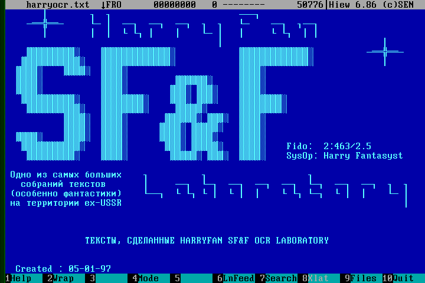

# HarryFan Reader - Retro MS-DOS Style Text Viewer from Fidonet era

[](https://app.codacy.com/gh/vt887/harryfan-reader?utm_source=github.com&utm_medium=referral&utm_content=vt887/harryfan-reader&utm_campaign=Badge_Grade)

A nostalgic text viewer for macOS that emulates the classic MS-DOS aesthetic with blue background, white text, and support for CP866 encoding (perfect for Cyrillic text files).




## Features

- **Retro MS-DOS Aesthetic**: Blue background with white text, reminiscent of classic DOS applications (credits to Peter Norton, USA)
- **CP866 Encoding Support**: Native support for Cyrillic text files encoded in CP866 with correct pseudographics mapping and proper line ending handling
- **MS-DOS Fonts**: Uses by default the VDU 8x16 pixel font for authentic retro appearance (credits to Oleg V. Baranovskiy, Kyiv, Ukraine)
- **Navigation**: PageUp/PageDown, GotoStart/GotoEnd, line-by-line navigation
- **Search**: Forward and backward text search with case-insensitive matching
- **Bookmarks**: Save and manage bookmarks for quick navigation
- **Settings**: Customizable font size, font selection, text processing options, and word wrap settings with macOS-style interface including Cancel/Submit buttons
- **Keyboard Shortcuts**: Full keyboard navigation support

## Keyboard Shortcuts

- **Page Up/Down**: Navigate through pages
- **Home/End**: Go to start/end of file
- **Cmd+S**: Open search dialog
- **Cmd+G**: Go to the specific line
- **Cmd+B**: Show bookmarks
- **Cmd+,**: Open settings (with Cancel/Submit buttons)

## Menu Options

- **Help**: Show help information
- **Wrap**: Toggle word wrap on/off
- **Open**: Open a text file
- **Search**: Open search dialog
- **Goto**: Go to specific line
- **Bookm**: Show bookmarks
- **Start**: Go to start of file
- **End**: Go to end of file
- **Menu**: Open settings
- **Quit**: Exit application

## Requirements

- macOS 14.0 or later
- Xcode 15.0 or later (for building)

## Building the Application

### Option 1: Using Swift Package Manager (Recommended)
```bash
# Build the application
swift build

# Run the application
swift run

# Or use the build script
./build.sh
```

### Option 2: Using Xcode
1. Clone or download this repository
2. Open `harryfan-reader.xcodeproj` in Xcode
3. Select your target device (macOS)
4. Build and run the project (Cmd+R)

## Usage

1. Launch HarryFan Reader
2. Click "Open File" or use Cmd+O to select a text file
3. The application will automatically detect CP866 encoding for Cyrillic text
4. Use the bottom menu bar or keyboard shortcuts for navigation
5. Access settings via the menu bar or Cmd+, to customize the appearance
6. Use "Wrap" button or settings to toggle word wrap functionality

## File Support

- **Text Files**: All plain text files (.txt, etc.)
- **Encoding**: CP866 (Cyrillic, MS-DOS)
- **Languages**: Optimized for Cyrillic text, supports all languages
- **CP866 Support**: Full CP866 code page support with correct character mapping based on [Wikipedia CP866 specification](https://en.wikipedia.org/wiki/Code_page_866) and real file analysis
  - Cyrillic characters (А-Я, а-я) with proper positioning according to official CP866 standard
  - Special characters (Ё, ё, Є, є, Ї, ї, Ў, ў, І, і, Ґ, ґ, Ђ, ђ, Ѓ, ѓ)
  - Box drawing characters (─, │, ┌, ┐, ═, ║, ╔, ╗, etc.)
  - Block characters (█, ▄, ▌, ▐, ▀, ░, ▒, ▓)
  - Mathematical symbols (≤, ≥, √, ≈, etc.)
  - **Verified with real CP866 files** (HARRYOCR.TXT, README.1ST)
- **Line Ending Support**: Proper handling of different line ending formats
  - Windows/DOS format (CR+LF: \r\n)
  - Unix/macOS format (LF: \n)
  - Legacy Mac format (CR: \r)
- **Text Processing**: Smart handling of empty lines and excessive whitespace
- **Word Wrap**: Automatic line wrapping with configurable width (40-200 characters)

## Technical Details

- Built with SwiftUI for macOS
- Uses loadable [PSF fonts](https://en.wikipedia.org/wiki/PC_Screen_Font) for authentic MS-DOS appearance
- Custom text rendering engine to handle CP866 and pseudographics
- Memory-efficient text loading for large files
- Native macOS integration with proper window management

## Inspired By

This application is inspired by classic MS-DOS text viewers and the [Giant Log Viewer](https://github.com/sunny-chung/giant-log-viewer) project, bringing the nostalgic feel of retro computing to modern macOS.

Also, would like to say thanks to Igor Zagumennov (AKA Harry Fan 2:463/2.5) and Vladimir Leeman (2:463/2)

## License

This project is open source and available under the GNU GPL License.

## Contributing

Contributions are welcome! Feel free to submit issues, feature requests, or pull requests to improve the application.
